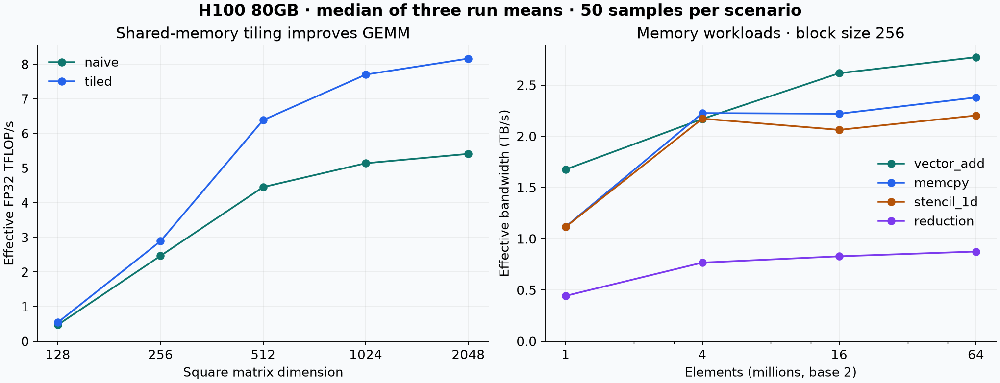
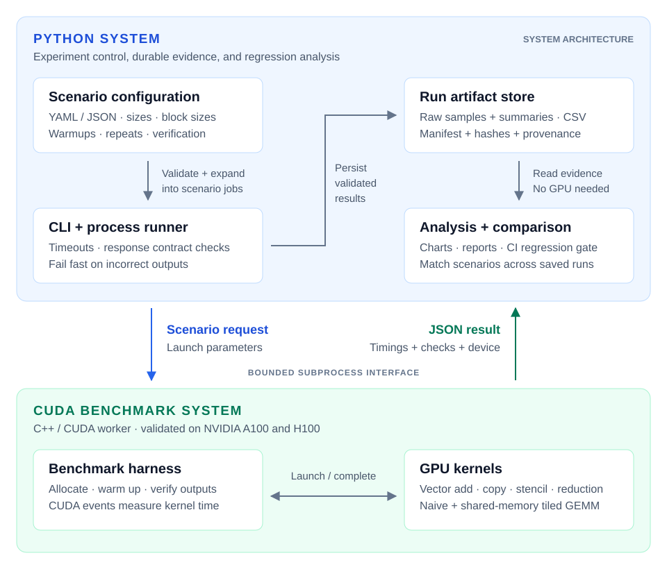

# GPU Performance & Power Analyzer

A reproducible GPU benchmarking toolkit that connects kernel speed, measured board power, and power-model validation. Run CUDA experiments, compare performance and energy tradeoffs, and retain the raw evidence behind every result.

[Timing results](docs/real_gpu_validation.md) · [Power results](results/h100-power-2026-09-22/REPORT.md) · [Engineering decisions](docs/engineering.md) · [Compare runs](docs/comparisons.md) · [Reproduce](docs/reproducibility.md)

## Results you can inspect

Validated on **NVIDIA H100 80GB HBM3**, with recovered **A100 80GB PCIe** evidence for comparison. The H100 study covers **74 configurations × 3 independent sweeps × 50 samples = 11,100 raw timings**, plus a 24-scenario compatibility run and 18 boundary correctness cases. All requested correctness checks passed.

| H100 workload | Result | Evidence |
| --- | --- | --- |
| FP32 GEMM, 2048 × 2048 | Tiled: **8.16 TFLOP/s**, **1.51×** naive | Median of three run means |
| Vector add, 67.1M elements, 256 threads/block | **2.77 TB/s** effective bandwidth | Declared bytes / measured runtime |
| A100 → H100, tiled GEMM, 512 × 512 | **1.65×** observed speedup | 69.91 → 42.26 μs in matched scenarios |
| Repeatability across 74 configurations | Largest run-mean spread: **3.17%** | All three sweeps retained |

Cross-GPU ratios describe the captured runs: compiler versions, source revisions, and dates differ. Effective throughput is derived, not a hardware counter. Two configurations exceeded 10% within-run CV in at least one trial; the comparison report flags that noise. [Methodology, counters, and limitations →](docs/real_gpu_validation.md)



## Measured power and optimization

The H100 power study covers **8 configurations × 3 randomized trials**, with **2,023 raw telemetry readings**. All 24 workloads passed correctness checks.

| FP32 GEMM, 2048 × 2048 | Sustained throughput | Measured board power | Estimated energy / launch |
| --- | ---: | ---: | ---: |
| Naive | 5.41 TFLOP/s | 471.4 W | 1.496 J |
| Tiled | 8.19 TFLOP/s | 408.0 W | 0.856 J |

Tiled GEMM achieved **1.51× throughput and 42.8% lower estimated energy per launch**. Power is sampled board telemetry; energy per launch combines steady mean power with sustained launch rate. [Raw evidence, all workloads, and sampling limits →](results/h100-power-2026-09-22/REPORT.md)

Power models use separate artifacts and hold out entire trials. Linear regression achieved **3.11 W mean held-out RMSE** across three folds. This validates repeat-session behavior on one H100; cross-GPU generalization remains future work. [Model evidence →](results/h100-power-model-2026-09-22/REPORT.md) [Methodology and commands](docs/power_measurement.md) · [Integration review](docs/repository_integration.md) · [GPU validation plan](docs/gpu_validation_plan.md)

## How it works



- **Bounded worker execution:** subprocess timeouts, checked JSON responses, exact scenario matching, and fail-fast correctness checks.
- **Reproducible evidence:** every timing sample, GPU metadata, binary/config/source hashes, and separate metric provenance.
- **Regression checks:** compare matching configurations, flag missing coverage and noisy measurements, export JSON/CSV/Markdown, and return CI exit codes.
- **Portable validation:** CPU-only fixtures exercise orchestration and analysis; CUDA runs validate kernel behavior separately.

The system uses local files and a CLI. [Design decisions and current limits →](docs/engineering.md)

## Try it without a GPU

Requires Python 3.10+. From a checkout:

```bash
python -m venv .venv
source .venv/bin/activate
python -m pip install -e ".[dev]"

# Rebuild the comparison from committed raw A100 and H100 evidence.
python -m gpu_kernel_analyzer compare \
  --baseline results/a100-2026-04-28 \
  --candidate results/h100-2026-09-22/baseline \
  --allow-device-mismatch --statistic mean \
  --outdir outputs/a100-h100
```

Open `outputs/a100-h100/REPORT.md` to inspect all 12 matching scenarios. No GPU is needed to compare or analyze existing runs. A [fixture demo](docs/demo.md) also exercises the full pipeline with explicitly synthetic timings.

## Run on your GPU

Requires an NVIDIA GPU, CUDA Toolkit (`nvcc`), and CMake 3.21+.

```bash
cmake -S benchmarks -B build -DCMAKE_BUILD_TYPE=Release
cmake --build build --config Release -j 4

python -m gpu_kernel_analyzer benchmark sweep \
  --binary build/gpu_benchmark \
  --scenarios configs/benchmark_scenarios.yaml \
  --outdir outputs/run

python -m gpu_kernel_analyzer artifacts validate --run-dir outputs/run
python -m gpu_kernel_analyzer analyze full --run-dir outputs/run
```

Use a new output directory for each sweep. The default suite has 24 scenarios. For the larger repeated study, run `PYTHON=python bash scripts/cross_validate_gpu.sh`; see [reproducibility](docs/reproducibility.md) for build settings and the published capture commands.

## Gate a performance change

Capture `outputs/before` and `outputs/after` on the same GPU, then:

```bash
python -m gpu_kernel_analyzer compare \
  --baseline outputs/before --candidate outputs/after \
  --outdir outputs/regression --threshold-pct 5 \
  --fail-on-regression
```

The default statistic is median runtime. The gate fails for a slowdown over the threshold, excessive within-run variability, missing baseline coverage, or changed device/warmup/repeat settings. Cross-device comparisons require explicit opt-in and cannot pass a CI gate. [Policy and exit codes →](docs/comparisons.md)

## Workloads and measurement scope

| Kernel | What it exercises |
| --- | --- |
| `vector_add` | Three-array streaming access |
| `memcpy_bandwidth` | Device-to-device copy kernel |
| `stencil_1d` | Neighbor reads and boundary handling |
| `reduction` | Shared-memory tree reduction into block partial sums |
| `gemm_naive` | FP32 matrix multiplication with direct global reads |
| `gemm_tiled` | FP32 matrix multiplication using 16 × 16 shared-memory tiles |

CUDA events measure kernel execution; allocations, host/device copies, and CPU verification are outside the timed interval. Reduction timing excludes the final CPU aggregation. GEMM uses ordinary FP32 arithmetic, not Tensor Cores or cuBLAS. Simple deterministic inputs provide smoke checks, not exhaustive numerical validation.

Nsight Compute supplies optional hardware counters for exact scenarios. Model predictions stay in separate files. The optional ridge model and tuning advisor are exploratory; [usage and limitations](docs/modeling.md) are documented separately.

## Code and tests

```text
benchmarks/                CUDA kernels, event timing, JSON worker
src/gpu_kernel_analyzer/   Timing, sustained power capture, comparison, reporting
src/gpu_power_pipeline/    Power models, telemetry adapters, registry, API
configs/                   Baseline, scaling, and boundary suites
results/                   Captured A100/H100 evidence and generated charts
scripts/                   GPU validation and result regeneration
tests/                    CPU tests and deterministic worker fixture
docs/                     Methodology, design, reproduction, and results
```

```bash
python -m pip install -e ".[dev,power,api,lint]"
python -m pytest -q
ruff check .
```

GitHub Actions runs CPU tests on Python 3.10–3.12 and lint checks. The published H100 capture was validated locally; GPU performance is not tested by hosted CPU CI.

[MIT license](LICENSE) · [Power-pipeline attribution](third_party/gpu-power-modeling/ORIGIN.md)
