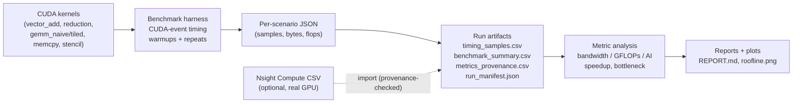

# GPU Kernel Performance Analyzer

> A reproducible CUDA benchmarking + analysis tool that times GPU kernels with CUDA
> events, derives bandwidth / GFLOPs / arithmetic-intensity, classifies kernels as
> memory- or compute-bound, and (optionally) overlays **real** Nsight Compute profiler
> metrics — with strict separation between *measured* and *derived* numbers.

**In one sentence:** I write CUDA kernels (vector add, reduction, naive vs tiled GEMM,
memory-copy, stencil), benchmark them rigorously, and turn the raw timings into honest
performance analysis (CSVs, plots, a roofline view, and a Markdown report).

```text
CUDA kernels ──▶ benchmark harness ──▶ JSON/CSV artifacts ──▶ metric analysis ──▶ reports + plots
                 (CUDA-event timing)    (per-run, validated)   (bandwidth/GFLOPs)   (roofline, bottleneck)
```

- **Language split:** CUDA/C++ for the kernels + timing harness, Python for orchestration, analysis, plotting, and reporting.
- **Integrity first:** every metric is tagged `measured`, `derived_estimate`, or `unavailable`, and the validator *refuses* to label profiler metrics as measured unless real Nsight data was imported.
- **Runs without a GPU too:** the Python analysis layer is fully testable on CPU-only CI using committed sample artifacts.

---

## Why this matters

GPU kernels rarely run slowly because of "bad code" alone — they run slowly because
they hit a **hardware limit**. Performance engineering is about identifying *which*
limit:

- **Memory bandwidth** — how many GB/s you move between DRAM and the SMs. Kernels like
  vector add or a copy do almost no math per byte, so they are capped by bandwidth.
- **Compute throughput (GFLOPs)** — how many floating-point ops/second you sustain.
  Large matrix multiplies do lots of math per byte, so they can be compute-bound.
- **Arithmetic intensity (FLOP/byte)** — the ratio that decides which limit applies.
  Low intensity ⇒ memory-bound; high intensity ⇒ compute-bound. This is the x-axis of a
  **roofline** model.
- **Profiling** — tools like Nsight Compute report *what the hardware actually did*
  (occupancy, SM/memory throughput, cache behavior), which validates or contradicts the
  derived estimates.

This project makes those concepts concrete and measurable, and is careful to never
present a derived estimate as if it were a profiler measurement.

---

## Features

- Four-plus CUDA kernels covering the memory-bound → compute-bound spectrum.
- Correct **CUDA-event timing** with warmups, repeated trials, and full per-sample retention.
- Summary statistics per scenario: **mean, median, min, max, p95, stddev, and CV** (stability).
- Derived metrics: **effective bandwidth (GB/s), effective GFLOPs, arithmetic intensity**.
- **Speedup vs baseline** (tiled vs naive GEMM) computed from measured runtime.
- **Roofline plot** and per-kernel bandwidth/GFLOPs plots.
- Heuristic **memory-bound vs compute-bound** classification.
- Config-driven sweeps (YAML/JSON) with **validation errors and warnings** for bad configs.
- Per-run **artifact validation** (schema + metric-provenance policy).
- Optional **Nsight Compute** capture-plan, normalize, and import workflow — kept separate from timing claims.
- Deterministic, organized outputs and a generated `REPORT.md`.

---

## Pipeline



---

## Supported kernels

| Kernel | What it computes | Performance behavior it demonstrates |
|--------|------------------|--------------------------------------|
| `vector_add` | `c[i] = a[i] + b[i]` | Classic **memory-bound** kernel; effective bandwidth is the headline metric. |
| `memcpy_bandwidth` | `out[i] = in[i]` | Pure streaming copy; closest single-kernel proxy for **achievable DRAM bandwidth** (the memory roof). |
| `stencil_1d` | 3-point weighted stencil | Modest data reuse + **halo/boundary handling**; sits between copy and GEMM, still memory-bound. |
| `reduction` | block-wise sum (tree reduction) | Shared memory, `__syncthreads()`, and the **tree reduction** pattern. |
| `gemm_naive` | dense `C = A·B` | Compute-heavy but **un-tiled**: re-reads global memory and leaves performance on the table. |
| `gemm_tiled` | dense `C = A·B`, 16×16 shared-memory tiles | **Shared-memory tiling** to cut DRAM traffic; the optimized baseline for the speedup comparison. |

---

## Metrics and provenance

Every value carries a provenance status so estimates are never confused with measurements.

| Metric | Status | Source |
|--------|--------|--------|
| `runtime_ms` | `measured` | CUDA events (`cudaEventElapsedTime`) |
| `effective_bandwidth_GBps` | `derived_estimate` | `bytes_moved / runtime` |
| `effective_GFLOPs` | `derived_estimate` | `flops / runtime` |
| `arithmetic_intensity` | `derived_estimate` | `flops / bytes_moved` |
| `device_metadata` | `measured` | CUDA runtime API |
| `occupancy`, `sm_utilization`, `memory_throughput_pct`, `l2_throughput_pct`, `l2_cache_hit_rate` | `unavailable` until imported, then `measured` | **Nsight Compute** CSV import only |

> Nsight Compute timing overhead is **never** used for `runtime_ms`. CUDA-event timing is
> the single source of truth for runtime. Profiler metrics only become `measured` for the
> exact scenarios where a real Nsight CSV was imported.

---

## Quickstart

### 1. Build the CUDA harness (requires a CUDA-capable GPU + `nvcc`)

```bash
cmake -S benchmarks -B build
cmake --build build --config Release
```

Binary: `build/gpu_benchmark` (Linux) or `build/Release/gpu_benchmark.exe` (Windows).
Set `CUDAToolkit_ROOT` if CMake cannot find the toolkit.

### 2. Run a benchmark sweep

```bash
python -m gpu_kernel_analyzer benchmark sweep \
  --binary build/gpu_benchmark \
  --scenarios configs/benchmark_scenarios.yaml \
  --outdir outputs/run_mvp
```

### 3. Validate artifacts (schema + metric policy)

```bash
python -m gpu_kernel_analyzer artifacts validate --run-dir outputs/run_mvp
```

### 4. Analyze: heuristics, speedup, plots, roofline, and report

```bash
python -m gpu_kernel_analyzer analyze full --run-dir outputs/run_mvp \
  --peak-gflops <real_fp32_peak> --peak-bandwidth-gbps <real_dram_peak>   # optional roofline ceilings
```

`--peak-*` are optional. If omitted, the roofline shows only your measured operating
points (no fabricated hardware ceilings). Supply your GPU's real peaks to draw the roofs.

### No GPU? Run the CPU-only fixture demo

Validates the full Python pipeline (sweep orchestration, schema, analysis, plots, report)
using a fake benchmark binary. **Fixture outputs are sample-only and must not be cited as
real GPU performance.**

```bash
python -m gpu_kernel_analyzer benchmark sweep \
  --binary tests/fixtures/fake_benchmark.py --binary-interpreter python \
  --scenarios configs/benchmark_scenarios.yaml --outdir outputs/sample_fixture
python -m gpu_kernel_analyzer artifacts validate --run-dir outputs/sample_fixture
python -m gpu_kernel_analyzer analyze full --run-dir outputs/sample_fixture
```

---

## Sample output

`analyze full` writes a self-contained run directory:

```text
outputs/run_mvp/
├── run_manifest.json            # git commit, device, env, scenario hashes, Nsight status
├── timing_samples.csv           # every raw CUDA-event sample
├── benchmark_summary.csv        # per-scenario mean/median/min/max/p95/stddev/cv + derived metrics
├── metrics_provenance.csv       # one row per metric with measured/derived/unavailable status
├── analysis_heuristics.csv      # memory- vs compute-bound classification
├── analysis_speedup.csv         # tiled vs naive GEMM speedup
├── plots/
│   ├── runtime_vs_size_gemm.png
│   ├── effective_gflops_vs_size_gemm.png
│   ├── effective_bandwidth_vs_size_vector_reduction.png
│   ├── effective_bandwidth_vs_size_memory_kernels.png
│   └── roofline.png
└── REPORT.md                    # human-readable summary of the run
```

### Real GPU validation snapshot (NVIDIA A100 80GB PCIe)

These are **real measured numbers** from a validation run, not estimates or examples.
They were captured with an earlier scenario set; the newer `memcpy_bandwidth` and
`stencil_1d` kernels have not yet been re-validated on a GPU (see Future Work).

- GPU: NVIDIA A100 80GB PCIe · CUDA Toolkit 13.0 · Python 3.11.9
- Artifact validation: passed · Nsight imported only for selected scenarios

| Comparison (512×512 GEMM) | Effective GFLOPs (derived) |
|---------------------------|----------------------------|
| `gemm_tiled` | ~3840 |
| `gemm_naive` | ~2589 |
| **Speedup (tiled vs naive)** | **~1.48×** |

Nsight Compute metrics for `vector_add` (size 4194304, block 256), imported from real
profiler CSV: occupancy ~76.72%, SM utilization ~21.36%, memory throughput ~71.42%, L2
throughput ~77.37%. `l2_cache_hit_rate` stays `unavailable` because it was not captured.
A sanitized copy of this capture is committed at
`examples/ncu_raw_vector_add_4194304_b256.csv` for GPU-less demos and tests.

---

## Optional Nsight Compute workflow

```bash
# 1. Detect Nsight Compute
python -m gpu_kernel_analyzer profile ncu-detect

# 2. Print the exact raw-capture + import commands for one scenario
python -m gpu_kernel_analyzer profile ncu-plan --binary build/gpu_benchmark \
  --kernel vector_add --problem-size 4194304 --block-size 256 --warmups 10 --repeats 30 --verify \
  --raw-csv-out outputs/run_mvp/ncu_raw_vector_add.csv \
  --normalized-csv outputs/run_mvp/ncu_norm_vector_add.csv --run-dir outputs/run_mvp

# 3. Normalize raw Nsight CSV → import format (works on the committed sample)
python -m gpu_kernel_analyzer profile ncu-normalize \
  --raw-csv examples/ncu_raw_vector_add_4194304_b256.csv \
  --out-csv outputs/run_mvp/ncu_norm_vector_add.csv \
  --kernel vector_add --problem-size 4194304 --block-size 256 --metric-set default_profiler_set

# 4. Import normalized metrics (rejected unless they map to an exact benchmark scenario)
python -m gpu_kernel_analyzer profile ncu-import --run-dir outputs/run_mvp \
  --source-tool ncu --source-file ncu_raw_vector_add.csv \
  --metric-set default_profiler_set --ncu-csv outputs/run_mvp/ncu_norm_vector_add.csv
```

---

## Project structure

```text
benchmarks/                 CUDA/C++ harness
├── include/                kernel + harness headers
└── src/
    ├── benchmark_runner.cu CLI parsing + JSON output
    ├── cuda_utils.cu       device query + CUDA error checks
    └── kernels/            one .cu per kernel
configs/
├── benchmark_scenarios.{yaml,json}  sweep definitions
└── ncu_metric_sets.yaml             Nsight metric-set mappings
src/gpu_kernel_analyzer/    Python package
├── cli.py                  command-line interface
├── scenarios.py            config loading, expansion, validation + warnings
├── runner.py               invokes the benchmark binary
├── metrics.py              summary stats + derived metrics + provenance status
├── analysis.py             bottleneck heuristics + speedup
├── plotting.py             matplotlib plots + roofline
├── report.py               Markdown report generation
├── ncu.py                  Nsight capture-plan / normalize / import
├── artifacts.py            artifact schema + provenance validation
└── ...
examples/                   sanitized sample Nsight raw CSV
tests/                      pytest suite (CPU-only) + fixtures
docs/                       methodology, metrics policy, reproducibility
```

---

## Engineering decisions

- **Why CUDA event timing?** `cudaEvent` timestamps are recorded on the GPU stream, so
  they measure device-side kernel execution without host-launch/CPU-clock noise. Wall-clock
  timers around an async launch would mostly measure launch overhead.
- **Why warmups + repeated trials?** The first launches pay one-time costs (context/JIT,
  allocation, cold caches, clock ramp-up). Warmups absorb those; repeated timed trials let
  me report a distribution (min/median/mean/p95) and a **CV** that signals whether a result
  is stable enough to trust.
- **How is profiler overhead handled?** Nsight Compute serializes and replays kernels, so
  its timing is not representative. I keep Nsight strictly for *hardware* counters and never
  let it override the CUDA-event `runtime_ms`. The validator enforces this.
- **Why does tiled GEMM beat naive GEMM?** Naive GEMM re-reads A and B from global memory
  for every output element. Tiled GEMM stages 16×16 tiles in shared memory so each loaded
  value is reused by a whole tile of threads, cutting DRAM traffic and raising arithmetic
  intensity — which is why effective GFLOPs go up.
- **How are bandwidth / GFLOPs / arithmetic intensity computed?** Each kernel declares the
  bytes it moves and the FLOPs it performs. Then
  `bandwidth = bytes/runtime`, `GFLOPs = flops/runtime`, `intensity = flops/bytes`. These
  are labeled `derived_estimate`, never `measured`.
- **What bottlenecks can it identify?** Low arithmetic intensity ⇒ memory-bound; high
  intensity with low achieved GFLOPs ⇒ compute-inefficiency; low bandwidth on a throughput
  kernel ⇒ underutilized memory path. The roofline view makes the memory-vs-compute regime
  visual, and imported Nsight occupancy/throughput corroborate the heuristic.

---

## How I would explain this in an interview

> "I built a CUDA benchmarking tool that times kernels with CUDA events using warmups and
> repeated trials, then reports a full distribution plus a coefficient of variation so I
> know the measurement is stable. From each kernel's declared byte and FLOP counts I derive
> effective bandwidth, GFLOPs, and arithmetic intensity, and I plot them on a roofline to
> classify kernels as memory- or compute-bound. The headline result is tiled vs naive GEMM:
> tiling stages data in shared memory, raises arithmetic intensity, and gives a measured
> speedup. The part I'm proudest of is the integrity model — every number is tagged
> measured, derived, or unavailable, and the validator refuses to call a profiler metric
> 'measured' unless I actually imported real Nsight Compute data for that exact scenario, so
> the tool can never overclaim."

---

## Testing and CI

```bash
pip install -e ".[dev]"
python -m pytest -q          # 39 passing CPU-only tests
```

- Tests cover config parsing/validation, summary statistics, derived metrics, speedup,
  artifact-schema validation, report/plot generation, roofline, and Nsight normalize/import.
- **CI runs on CPU-only GitHub Actions** and exercises everything except the CUDA kernels,
  using committed sample artifacts and a fake benchmark binary.
- **The CUDA benchmarks themselves require a CUDA-capable GPU and `nvcc` locally** — they
  cannot run in standard GitHub Actions.

---

## Future work

- Re-validate `memcpy_bandwidth` and `stencil_1d` on a GPU and add their results to the snapshot.
- Shared-memory tiled stencil to demonstrate a second optimization story.
- Parameterized GEMM tile sizes (currently fixed at 16×16) and a coarsened/`float4` variant.
- Auto-fill roofline ceilings from device metadata where peak specs are reliably queryable.
- Multi-run comparison / regression tracking across git commits.

---

## More documentation

- `docs/methodology.md` — timing methodology and derived-metric formulas
- `docs/metrics_policy.md` — measured vs derived vs profiler policy
- `docs/reproducibility.md` — reproducing a run
- `docs/demo.md` — end-to-end demo walkthrough
- `docs/real_gpu_validation.md` — the A100 validation record

## License

MIT — see `LICENSE`.
