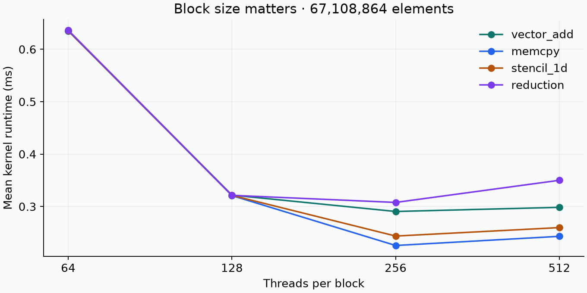

# GPU results: H100 validation and historical A100 comparison

The H100 study contains raw measurements for all six kernels, three independent scaling sweeps, boundary checks, and Nsight Compute counters. The A100 comparison uses recovered original timing artifacts, not values transcribed from the old README.

## Evidence and environment

| Capture | GPU | Scope | Source |
| --- | --- | --- | --- |
| April 28, 2026 | NVIDIA A100 80GB PCIe, 108 SMs | 12 scenarios, 300 samples | [Original artifacts](../results/a100-2026-04-28/) |
| September 22, 2026 | NVIDIA H100 80GB HBM3, 132 SMs | 24 baseline scenarios | [Baseline and report](../results/h100-2026-09-22/baseline/REPORT.md) |
| September 22, 2026 | Same H100 | 74 scenarios × 3 sweeps × 50 samples | [All 74 results and ranges](../results/h100-2026-09-22/AGGREGATE.md) |
| September 22, 2026 | Same H100 | 18 edge cases | [Correctness summary](../results/h100-2026-09-22/edges/benchmark_summary.csv) |

H100 build: CUDA 13.3.73, driver 595.71.05, CMake 3.26.5, GCC 12.3.0, Python 3.11.9, Release, CUDA architecture 90. The previous A100 documentation records CUDA 13.0; its original manifest records Python 3.11.9 but not the compiler flags. The GPUs were not measured under a common software stack.

The H100 was idle in pre-capture telemetry. Clocks were not locked. Captures ran sequentially in fixed scenario order; there was no randomized scheduling or controlled thermal experiment. [Before](../results/h100-2026-09-22/gpu-before.csv) and [after](../results/h100-2026-09-22/gpu-after.csv) telemetry, tool versions, dependencies, manifests, and raw timings are retained.

## H100 scaling

These values are medians of the three independent **run means**, each based on 50 CUDA-event samples after 20 warmups. Ranges span run means; they are not confidence intervals. Streaming workloads use 256 threads/block; GEMM uses a 16 × 16 block.

| Kernel | Size | Mean runtime (ms) | Range (ms) | Effective throughput |
| --- | ---: | ---: | --- | ---: |
| `vector_add` | 67,108,864 | 0.290634 | 0.290443–0.290708 | 2,770.9 GB/s |
| `memcpy_bandwidth` | 67,108,864 | 0.225754 | 0.225416–0.225791 | 2,378.1 GB/s |
| `stencil_1d` | 67,108,864 | 0.243771 | 0.243750–0.243899 | 2,202.4 GB/s |
| `reduction` | 67,108,864 | 0.307905 | 0.307786–0.307970 | 875.2 GB/s |
| `gemm_naive` | 2048 × 2048 | 3.176542 | 3.159608–3.177004 | 5,408.4 GFLOP/s |
| `gemm_tiled` | 2048 × 2048 | 2.105848 | 2.090242–2.105971 | 8,158.2 GFLOP/s |

Tiled GEMM is **1.51×** faster than naive at 2048² (ratio of the median run means). At 512² the corresponding ratio is **1.43×**. These are educational FP32 implementations, not comparisons with cuBLAS or Tensor Core kernels.

All 74 configurations have a run-mean spread below **3.18%**, computed as `(largest mean / smallest mean − 1) × 100`. Two configurations have within-run CV above 0.10 in at least one trial. The [repeatability report](../results/comparisons/h100-repeatability/REPORT.md) retains noise flags even when runtime changes stay within the 5% threshold. No outliers were deleted.

## A100 versus H100: matching historical scenarios

The H100 baseline uses the original warmup/repeat counts on every matched scenario: 10/30 for vector and reduction, 5/15 for GEMM. Twelve configurations overlap. Means are used here to match the historical throughput calculations.

| Scenario | A100 mean (μs) | H100 mean (μs) | A100 / H100 runtime |
| --- | ---: | ---: | ---: |
| Vector add, 4,194,304, block 256 | 37.85 | 23.26 | 1.63× |
| Reduction, 4,194,304, block 256 | 35.23 | 22.03 | 1.60× |
| Naive GEMM, 512², block 16 | 103.70 | 60.56 | 1.71× |
| Tiled GEMM, 512², block 16 | 69.91 | 42.26 | 1.65× |

[All matched scenarios, unmatched coverage, and metadata differences](../results/comparisons/a100-h100/REPORT.md) are generated by the `compare` command. The observed improvements validate that the workflow runs on both GPUs. They do **not** isolate hardware architecture effects: source revision, compiler, date, and environment differ. There is no A100 evidence for the expanded 74-scenario suite yet.

## Hardware counters

Separate Nsight Compute captures profiled one launch after warmup for each scenario. Counters were normalized and imported into the H100 baseline with source provenance. These are individual profile observations, not averages over the three timing sweeps.

| Counter (%) | Vector add, 4,194,304, block 256 | Tiled GEMM, 512², block 16 |
| --- | ---: | ---: |
| Achieved occupancy | 74.98 | 71.72 |
| SM throughput relative to sustained peak | 18.90 | 56.46 |
| DRAM throughput relative to sustained peak | 66.87 | 1.46 |
| L2 throughput relative to sustained peak | 74.11 | 13.78 |
| L2 sector hit rate | 34.44 | 89.89 |

[Raw captures, normalized CSVs, and profiler version](../results/h100-2026-09-22/profiler/) are retained. The contrast is consistent with the vector workload stressing memory while tiled GEMM reuses data, but counters alone do not establish the sole bottleneck. Nsight replay changes execution conditions and its embedded runtime samples are **excluded** from benchmark timing artifacts.

## Correctness and measurement limits

- All 264 H100 scenario executions requested verification and passed: 24 baseline, 222 repeated scaling, and 18 boundary cases. GEMM checks every output element; the historical implementation checked eight diagonal entries.
- Boundary cases cover sizes 1, 33, and 1003 for streaming/reduction kernels and 1, 17, and 257 for GEMM. They test partial blocks/tiles, not a comprehensive numeric oracle. Inputs remain simple deterministic values.
- Timings exclude allocation, transfers, and host-side verification. Reduction measures block partial sums; the final host aggregation is not timed.
- Declared byte counts estimate useful traffic, not actual DRAM transfers. In particular, both GEMMs use the same `3 × N² × sizeof(float)` logical footprint. The arithmetic-intensity estimate does not distinguish their actual traffic. Cached small workloads and stencil reuse further limit DRAM interpretations.
- Derived GFLOP/s is not a hardware operation count. Roofline points and heuristic classifications are estimates, not proof of a measured bottleneck. Hardware ceilings were not supplied for this capture.
- Three sequential sweeps show local repeatability, not broad reproducibility across machines, power states, or software versions.

## Reproduce or extend

Follow [reproducibility](reproducibility.md) to rerun the exact configurations, regenerate figures, and compare the files. The most useful next experiment is running `configs/cross_validation.yaml` three times on the A100 with the same source revision and build policy, then reporting matched scenarios and variability on both devices.
