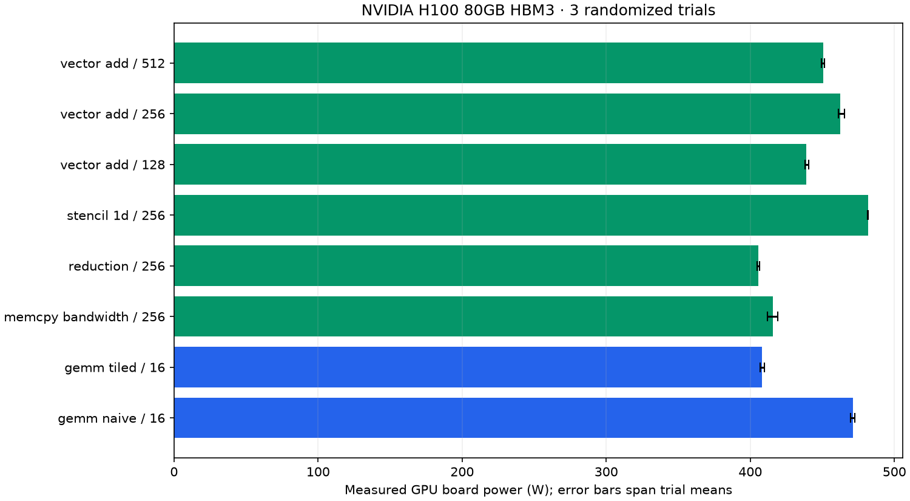

# Measured power and sustained throughput

Device: **NVIDIA H100 80GB HBM3**. 24 workload windows; 2023 raw telemetry rows; 1123 steady-window rows.

| Workload | Block | Board power, mean [trial range] W | Sustained effective GB/s | Sustained GFLOP/s | Estimated mJ/launch |
| --- | ---: | ---: | ---: | ---: | ---: |
| gemm_naive | 16 | 471.4 [469.6, 472.5] | 15.9 | 5413.3 | 1496.138 |
| gemm_tiled | 16 | 408.0 [406.9, 409.8] | 24.0 | 8188.1 | 856.061 |
| memcpy_bandwidth | 256 | 415.5 [411.8, 418.9] | 2401.2 | 0.0 | 92.911 |
| reduction | 256 | 405.6 [404.6, 406.4] | 884.5 | 220.3 | 123.597 |
| stencil_1d | 256 | 481.6 [481.3, 481.9] | 2221.3 | 1388.3 | 116.398 |
| vector_add | 128 | 439.0 [438.1, 440.4] | 2518.2 | 209.9 | 140.374 |
| vector_add | 256 | 462.6 [461.0, 465.3] | 2792.7 | 232.7 | 133.389 |
| vector_add | 512 | 450.4 [449.4, 451.6] | 2715.7 | 226.3 | 133.573 |

## Optimization result

At the matched 2048 × 2048 FP32 GEMM size, tiled GEMM achieved **1.51× sustained throughput** and **42.8% lower estimated energy per launch** than naive GEMM. This compares these custom kernels on this device under the captured protocol.

## Measurement scope

These are real `nvidia-smi:power.draw` readings, not model predictions. Energy is estimated by trapezoidal integration over covered steady samples. Every workload passed its deterministic correctness check.

Each workload executes batches of 100 launches in a persistent allocation for at least 15 seconds. The first and last 2 seconds are excluded from power summaries. Launch throughput uses the complete sustained window including batch synchronization and host launch overhead. Estimated energy per launch combines steady mean watts with whole-window launch rate; it is not an isolated per-kernel energy measurement. Effective bytes/FLOPs use the existing workload formulas, not hardware counters.

H100 power telemetry is approximately one-second averaged. Samples taken more often are correlated. Trial ranges are descriptive, not confidence intervals. Pre-workload idle readings include recent thermal history; no idle subtraction is applied. No clocks or power limits were changed. GPU-board power is not wall-socket or full-server power.

Use same-workload, same-size comparisons for optimization. GEMM bytes count matrix sizes and do not measure actual DRAM traffic. These custom FP32 kernels do not use Tensor Cores or cuBLAS.

## Evidence and regeneration

- [Manifest, device, binary/source hashes and protocol](manifest.json)
- [Every telemetry query](telemetry.csv)
- [Steady telemetry for modeling](steady_telemetry.csv)
- [Per-trial summaries](summary.csv)
- [Aggregates](aggregate.csv)
- [Worker JSON and measurement boundaries](workers/)

From the repository root: `python scripts/summarize_power.py --run-dir results/h100-power-2026-09-22`.

Regeneration verifies artifact hashes and recomputes power/energy summaries from raw samples before writing the table and chart.
