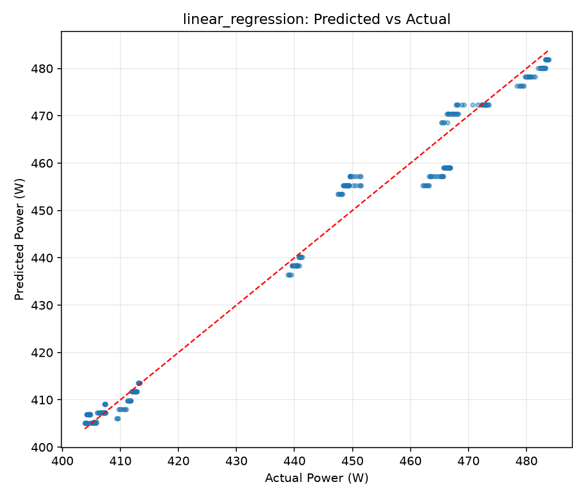
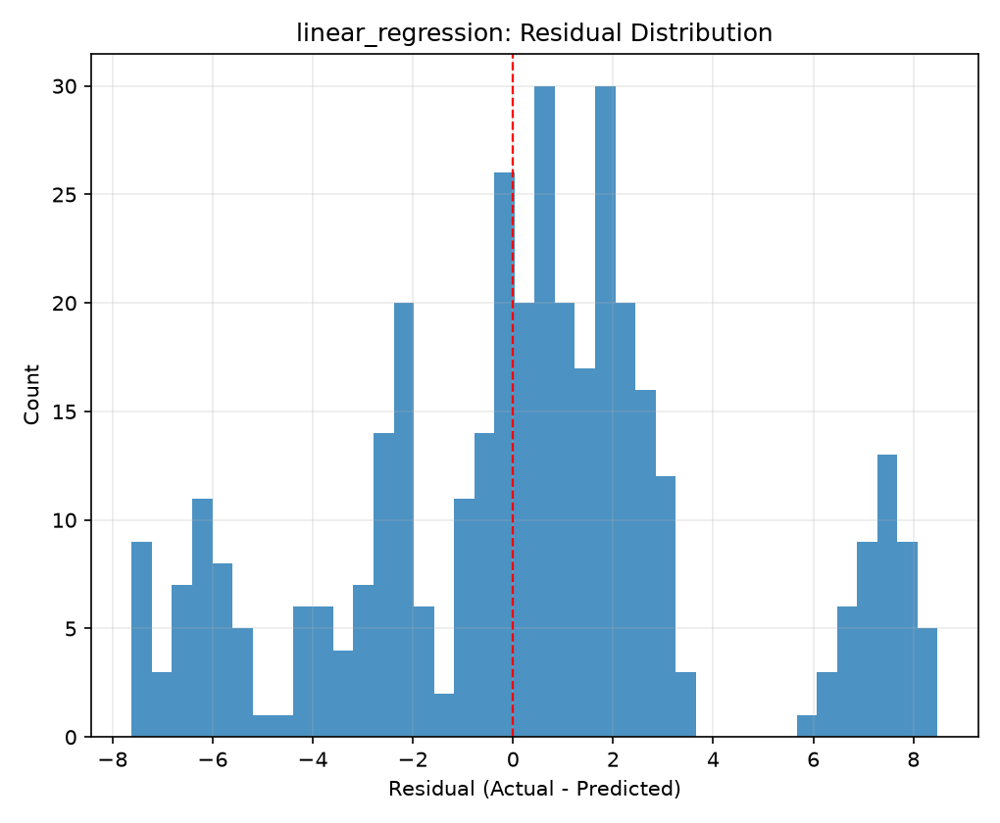

# One-Page Experiment Report

## Context
- Dataset source: `local_nvidia_smi`
- Objective: predict `power_watts` from measured, public, or synthetic telemetry.

## Model Comparison
| model | mae | rmse | r2 |
| --- | --- | --- | --- |
| linear_regression | 2.890264390965458 | 3.803198260405953 | 0.9822305457324788 |
| random_forest | 2.9793097417711683 | 3.8722276287148745 | 0.9815796483270466 |
| gradient_boosting | 3.0150481970730056 | 3.937957588790642 | 0.9809489802329908 |

## Target Quality Summary
| count | missing_targets | min | max | mean | median | p95 | p99 | outlier_ratio_p99_over_p50 | invalid_grouped_metric_risk |
| --- | --- | --- | --- | --- | --- | --- | --- | --- | --- |
| 1123 | 0 | 403.86 | 483.86 | 441.6091807658059 | 441.12 | 481.818 | 483.2612 | 1.0955322814653607 | False |

## Recommended Primary Metric (Use This)
Grouped blocked CV is the primary reported metric for this project.
It holds out complete sessions/files. Generalization depends on how those groups were constructed; repeated trials on one GPU do not establish cross-device performance.
| model | mae | rmse | r2 |
| --- | --- | --- | --- |
| linear_regression | 2.3826713648855646 | 3.1074156645159547 | 0.9872876881204012 |

## Secondary Diagnostic Metrics (Optimistic)
Random/time split results are retained only as secondary diagnostics and can be optimistic.
| split_strategy | model | mae | rmse | r2 |
| --- | --- | --- | --- | --- |
| random | random_forest | 1.5709007959361267 | 2.4880510058191314 | 0.9919989507458756 |
| time | linear_regression | 2.1383089426503603 | 2.830209176459082 | 0.9879308160386214 |

## Best Ablation Per Feature Set
_No rows._

## Best Hyperparameter Sweep Results
_No rows._

## Split Strategy Comparison (Best Per Strategy)
| split_strategy | model | mae | rmse | r2 |
| --- | --- | --- | --- | --- |
| grouped | linear_regression | 2.890264390965458 | 3.803198260405953 | 0.9822305457324788 |
| random | random_forest | 1.5709007959361267 | 2.4880510058191314 | 0.9919989507458756 |
| time | linear_regression | 2.1383089426503603 | 2.830209176459082 | 0.9879308160386214 |

## Grouped Blocked CV Summary
| model | mae | rmse | r2 |
| --- | --- | --- | --- |
| linear_regression | 2.3826713648855646 | 3.1074156645159547 | 0.9872876881204012 |
| random_forest | 2.3754555602197773 | 3.16305465099644 | 0.986821751781782 |

Grouped split is the most realistic because it holds out entire trace sessions rather than nearby rows.  
This avoids placing adjacent readings from the same session in both splits. It does not establish generalization to unseen GPU models or workload families.

## Leakage/Audit Snapshot
| n_rows | n_features_numeric | n_name_leakage_flags | n_corr_leakage_flags |
| --- | --- | --- | --- |
| 1123 | 6 | 0 | 0 |

## Selected Plots

